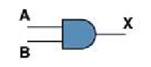
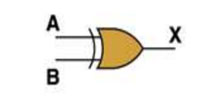
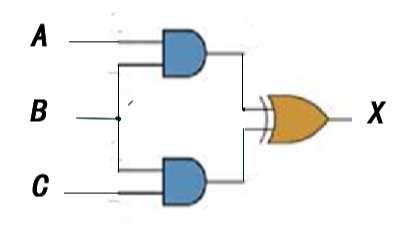
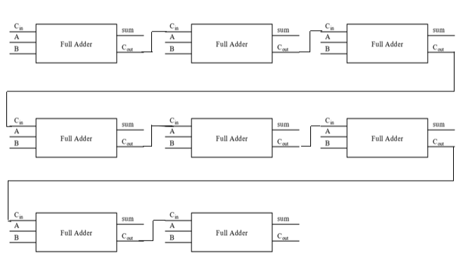

# 第五次作业

## Part 1 of 2

1. AND gate
    - Boolean Expression : X = A * B
    - Logic Diagram Symbol : 
    
    
    - Truth Table : 

        | A | B | X |
        |:--|:--|:--|
        | 0 | 0 | 0 |
        | 1 | 0 | 0 |
        | 0 | 1 | 0 |
        | 1 | 1 | 1 |
    - AND gate 是一种简单的逻辑电路，其作用是在输入两个电压时，能对两电压进行判断。当两电压都为高电压时，输出一个高电压。若两电压中有一个是低电压，则返回低电压。用 1 代表高电压，0 代表低电压时可表示为，输入 1 和 1 ，返回 1 。而输入的两个书中有一个是 0 时，返回 0 。

2. XOR gate
    - Boolean Expression : X = A ⊕ B
    - Logic Diagram Symbol :
    
    
    - Truth Table : 
    
        | A | B | X |
        |:--|:--|:--|
        | 0 | 0 | 0 |
        | 1 | 0 | 1 |
        | 0 | 1 | 1 |
        | 1 | 1 | 1 |

3. 


4. 
    | A | B | X |
    |:--|:--|:--|
    | 0 | 0 | 1 |
    | 0 | 1 | 0 |
    | 1 | 0 | 1 |
    | 1 | 1 | 1 |

5. 因为，（AB)' 的 truth table：

    | A | B | X |
    |:--|:--|:--|
    | 0 | 0 | 1 |
    | 0 | 1 | 1 |
    | 1 | 0 | 1 |
    | 1 | 1 | 0 |
并且，A' + B' 的truth table ：

| A | B | X |
|:--|:--|:--|
| 0 | 0 | 1 |
| 1 | 0 | 1 |
| 0 | 1 | 1 |
| 1 | 1 | 0 |
因此，由表可得，（AB）’ = A' + B'

6. 


7. - (X<sub>8</sub>X<sub>7</sub>X<sub>6</sub>X<sub>5</sub>X<sub>4</sub>X<sub>3</sub>X<sub>2</sub>X<sub>1</sub>)<sub>2</sub> or (00001111)<sub>2</sub> = (**X<sub>8</sub>X<sub>7</sub>X<sub>6</sub>X<sub>5</sub>X<sub>4</sub>1111**)<sub>2</sub>
   - (X<sub>8</sub>X<sub>7</sub>X<sub>6</sub>X<sub>5</sub>X<sub>4</sub>X<sub>3</sub>X<sub>2</sub>X<sub>1</sub>)<sub>2</sub> xor (00001111)<sub>2</sub> = (**X<sub>8</sub>X<sub>7</sub>X<sub>6</sub>X<sub>5</sub>X<sub>4</sub>'X<sub>3</sub>'X<sub>2</sub>'X<sub>1</sub>'**)<sub>2</sub>
   - ((X<sub>8</sub>X<sub>7</sub>X<sub>6</sub>X<sub>5</sub>X<sub>4</sub>X<sub>3</sub>X<sub>2</sub>X<sub>1</sub>)<sub>2</sub> and (11110000)<sub>2</sub>)
or ( not (X<sub>8</sub>X<sub>7</sub>X<sub>6</sub>X<sub>5</sub>X<sub>4</sub>X<sub>3</sub>X<sub>2</sub>X<sub>1</sub>)<sub>2</sub> and (00001111)<sub>2</sub>) = (**X<sub>8</sub>X<sub>7</sub>X<sub>6</sub>X<sub>5</sub>X<sub>4</sub>'X<sub>3</sub>'X<sub>2</sub>'X<sub>1</sub>'**)<sub>2</sub>

## 解释概念
### Logic gate
```
In electronics, a logic gate is an idealized or
physical device implementing a Boolean function;
that is, it performs a logical operation on one 
or more binary inputs and produces a single binary 
output.
一种在电子信息技术中的理想或者实际的设备，可对一个或多个二进制输入数据进行逻辑运算，并最终产生一个简单的二进制输出数据。
```

### Boolean algebra
```
In mathematics and mathematical logic, Boolean 
algebra is the branch of algebra in which the 
values of the variables are the truth values true
and false, usually denoted 1 and 0 respectively
布尔代数是定义在在数学和逻辑数学中，指代一类值为布尔值（通常是 0 或 1）的代数。
```

## Flip-flop
1. 翻译： 触发器
2. only one