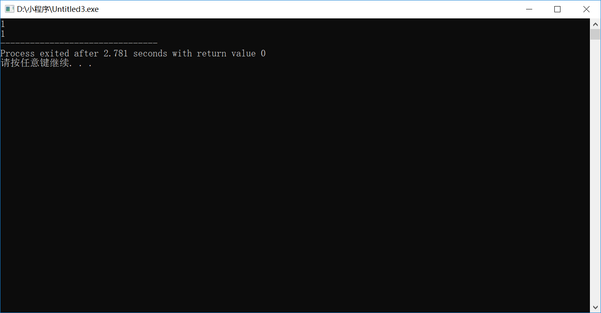
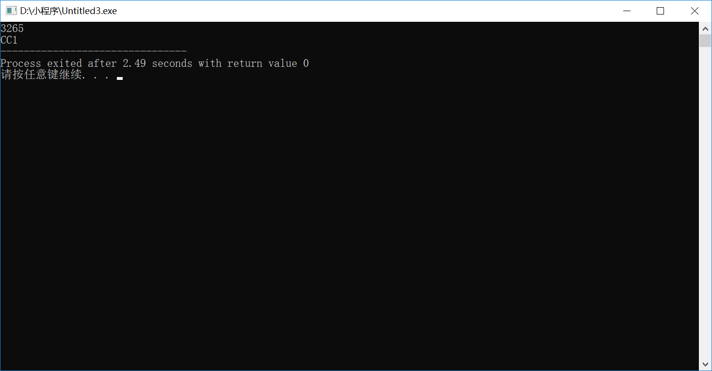

# 第八次作业
## 伪代码
1. 
    - 声明两个变量**input**和**num**
    - 将**num**初始化为0
    - 声明一个字符数组**output**大小为100字符
    - 输入一个十进制数值，赋值给**input**
    - 当**input**大于16时进入循环
    - **input**对*16*取余并把得到的数赋值给**output[num]**
    - 将**num**的值增加*1*
    - 将**input**的值除以16再赋值给**input**
    - 结束循环
    - 将**input**的值赋给**output[num]**
    - 对所有初始值为**num**的值的**i**，满足**i** >= *0*时进入循环
    - 如果**output[i]** > *9*，打印相对应的字母
    - 反之，打印出**output[i]**
    - 将**i**的值减少1
    - 结束循环
    - 结束程序

2. 
~~~
#include <stdio.h>
int main(){
    int input , num ;//声明两个变量input和num
    num = 0;//将num初始化为0
    int output[100];// 声明一个数组output大小为100字符
    scanf("%d",&input);// 输入一个十进制数值，赋值给input
    while(input >= 16){// 当input大于16时进入循环
    	output[num] = input % 16;// input对16取余并把得到的数赋值给output[num]
    	num++;// 将num的值增加1
    	input = input / 16 ;// 将input的值除以16再赋值给input
    }// 结束循环
    output[num] = input;// 将**input**的值赋给output[num]
    for(int i = num ; i >= 0 ; i--){ // 对所有初始值为num的值的i，满足i >= num时进入循环
    	if( output[i] > 9 ) printf("%c",('A' + (output[i] - 10)));// 如果output[i] > 9，打印相对应的字母
    	else printf("%d",output[i]);	// 反之，打印出output[i]
	// 将i的值减少1
    }// 结束循环
    return 0;
	}// 结束程序
~~~

3. 

## 词义解释
1. **Top-down design**：*It is a strategie of information processing and knowledge ordering, used in a variety of fields including software, humanistic and scientific theories (see systemics), and management and organization. In practice, it can be seen as a style of thinking, teaching, or leadership.*  
自上而下设计是一种处理信息，整理知识的方法，被使用在软件设计，社会学研究，科学理论和组织管理等方面。实际上，它可以视作一种思考、教学、领导的风格。

2. **Work breakdown structure(WBS)**：*A work-breakdown structure (WBS) in project management and systems engineering, is a deliverable-oriented breakdown of a project into smaller components.*  
工作分解结构在项目管理和系统工程领域，是将一个大的相符拆分成若干可以交付的小项目的结构体系。

3. **WBS**与**Work breakdown structure**的异同：
    - 相同点：都是从上到下将一个大的项目拆分成若干小项目
    - 不同点：所适用的领域不同。

## 洗衣机
### 正常洗衣
- 注水
- 浸泡
- 旋转洗涤
- 排水
- 注水
- 旋转洗涤
- 排水
- 甩干

### 各个步骤伪代码
1. 注水：
~~~
water_out_switch(open)
water_in_switch(close)
IF get_water_volume() >= 标准高度
   water_in_switch(close)
END IF
halt(returncode)
~~~

2. 浸泡：
~~~
REPEAT
    浸泡一秒
UNTIL time_counter() >= 标准时长
halt(returncode)
~~~

3. 旋转洗涤
~~~
FOR 1 to 标准次数
    REPEAT
        motor_run(left)
    UNTIL time_counter() >= 标准时长
    motor_run(stop)
    REPEAT
        motor_run(right)
    UNTIL time_counter() >= 标准时长
    motoe_run(stop)
END FOR
halt(returncode)
~~~

4. 排水
~~~
water_out_switch(open)
IF get_water_volume() = 0
water_out_switch(close)
halt(returncode)
~~~

5. 甩干
~~~
REPEAT
    motor_run(left)
UNTIL time_counter() >= 标准时长
halt(returncode)
~~~

### 正常洗衣与快速洗衣异同
1. 用户目标：
- 异：
    - 正常洗衣目的在于将衣服洗得足够干净
    - 快速洗衣的目的在于使用尽量短的时间把衣服洗到能穿的地步
- 同：都需要把衣服洗干净

2. 程序
- 异：
    - 每一个步骤时间等参数不同
    - 正常洗衣洗衣步骤更多一些
- 同：洗衣环节相同，程序上很多部分相似

3. 我认为存在改进（创新）空间。  
   快速洗衣与正常洗衣的程序相似度很高，只不过在时间等参数上存在差异，如果令每个环节都能读取输入数据，就可以把相同的代码应用在两种洗衣方式的程序中。

### 简化版正常洗衣
- 注水（注水标准高度）
- 浸泡（浸泡标准时长）
- 旋转洗涤（旋转标准次数，每次旋转标准时间）
- 排水
- 注水（注水标准高度）
- 浸泡（浸泡标准时长）
- 旋转洗涤（旋转标准次数）
- 甩干

每个环节具体代码：
1. 注水
~~~
water_out_switch(open)
water_in_switch(close)
IF get_water_volume() >= 标准高度
   water_in_switch(close)
END IF
halt(returncode)
~~~

2. 浸泡：
~~~
REPEAT
    浸泡一秒
UNTIL time_counter() >= 标准时长
halt(returncode)
~~~

3. 旋转洗涤
~~~
FOR 1 to 标准次数
    REPEAT
        motor_run(left)
    UNTIL time_counter() >= 标准时长
    motor_run(stop)
    REPEAT
        motor_run(right)
    UNTIL time_counter() >= 标准时长
    motoe_run(stop)
END FOR
halt(returncode)
~~~

4. 排水
~~~
water_out_switch(open)
IF get_water_volume() = 0
water_out_switch(close)
halt(returncode)
~~~

5. 甩干
~~~
REPEAT
    motor_run(left)
UNTIL time_counter() >= 标准时长
halt(returncode)
~~~