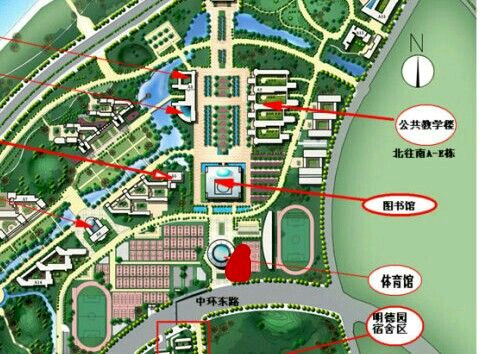
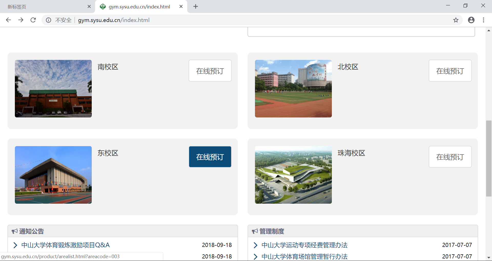

# 中大东校游泳教程

本人写这篇教程文章是出于自己的亲身经历。作为一个刚刚步入中大校园的大一萌新，在中大的第一次游泳可谓是一波三折。为了帮助更多喜欢游泳却不知如何正确操作的萌新们，我决定根据我个人的心得写一篇教程文章，希望能提供一些帮助。

## 1. 为校园卡申办运动卡服务
- 地点：体育馆103室（体育馆东南入口直走）（如下图）
- 时间：
    - 早上：8：00 - 11：30  
    - 下午：2：00 - 6：00
    - 周六周日休息
- 作用：可用于预约并使用游泳池（这是必要的前期准备）

## 2. 网上预约游泳馆
- 预约网址：<a href="http://gym.sysu.edu.cn/index.html" target="_blank">中山大学体育场馆管理预定系统</a>(如下图)
- 预约方式：用手机或电脑进入该网站，选择东校区游泳馆，预约一个喜欢的时间段。（可以晨泳哦！）
- 预约费用：5.00元/次 （从学校派发的体育经费中扣除）[感谢中大福利]
- 备注：虽然在网站里说也可以现场扣预定，但是网上预定是最方便的。

## 3. 游泳前准备
- 必备物资：
    - 泳衣泳裤：这是废话。
    - 泳帽：这个必须有，不然是不准下水游泳的，这在游泳馆楼下就可以买到。
    - 泳镜：在学校泳池，一个泳镜能保证必要的水下视野。否则，下饺子一样的泳池分分钟让你知道什么叫“车祸现场”
- 其他物资：
    - 锁头：游泳池的保险箱是没有配备锁头的，如果你担心自己的随身物品的安全，可以自带一个锁头。（虽然个人认为应该不太可能出现偷窃行为）
    - 水：虽然肯定会喝点泳池里的水，但最好还是自己带点水补充水分。
    - 食物：游泳是一项费体力的运动，带点食物可以及时解决你由于长时间运动而产生的饥饿感。

## 4. 开始游泳
- 地点：假草附近的体育馆二楼（没错，你没有听错，就是建在二楼的游泳池）
- 流程：在入口处刷校园卡检查预约情况后就可以上楼游泳了。
- 备注：游泳前记得热身。

## 5. 温馨提示
过段时间就要体测了，不太会游泳的同学记得早点开始去游泳馆练习。不要想着体测前几天再临时抱佛脚，那几天的游泳池比下饺子还可怕。

~~~
最后，祝各位萌新们游泳愉快
~~~