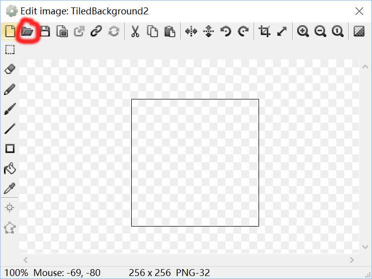

# HTML 5 游戏欢乐制作指南

不得不说，制作HTML5游戏是一件非常有趣的事情。特别是当你找到一些格外有趣的素材后，制作游戏的过程将成为你的一种享受。

本篇博客中我会介绍一下一种射击游戏的制作方法以及我个人的一些心得体验。请不要觉得制作游戏是一件多么高大上的事情，甚至认为只有程序员才能做到。实际上，我也曾一度如此认为。直到我真正接触到Contract2，我才明白，游戏制作原来也能这么简单。

## 制作游戏前的准备
- 工具 : Contract 2（在官网下载免费版即可） ， ps（用作素材处理）
- 素材 ：适合的图片（用于把怪兽、玩家、子弹、爆炸效果的设定为你**喜欢**的模样）
- 小技巧 ：出动**好**朋友的几张典藏版黑照，你将获得巨大的动力与快感。（为了你和他人的生命安全，请谨慎使用！要找到最合适的人，比如那些开的起玩笑的，真的打起来也打不过你的好朋友）

## 开始游戏制作

### 一、设置背景

*正如大家都知道的，每个游戏都是需要一个背景图，往后的游戏内容都会在这一背景中进行。因此，制作游戏的第一步，就是设定一个背景图*

- 新建layer：点击左上角**file**，选择**new**,新建一个**new empty project**。中央界面就会出现一个layout 1。
- 设置背景图：
    - 左键双击刚刚创建出来的空白界面，将出现一个可以设置背景的页面，选择**general**分组里的**Tiled Background**;
    - 此时你的鼠标会变成一个十字，你可以单击选择一个地方，它将成为你导入的背景图出现的地方；
    - 点击后，会出现图一的设置框（这是导入图片素材过程中常会出现的，你不必了解那些复杂的工具的具体用法，我们需要的只是最简单的导入一张图片就好），点击左上角的第二个图标**load an image from a file**，选择你需要的图片，打开后可以直接关闭该设置框或按下回车键，图片就会出现在画面中，你可以选中该图片调整大小，直到覆盖整个底板。
    - 锁定页面：如果你觉得自己已经找到了合适的图片，摆好了位置，为了避免在之后的操作中错误改变该图片，你需要把该layer锁定。在桌面右上侧你能找到图二的设置框，选中当前页面（一般是layer 0）,点击红圈中的锁头就可以把该layer锁定，点击那只铅笔就可以修改该layer的名字，一般情况下我们把它的名字修改为Background。
    - 图一
    - 图二
## 二 、设定游戏角色：
1. 新建一个layer。之前的layer已经锁定，我们无法再进行修改，因此我们需要新建一个layer。点击图二中的加号，一个新的layer就建好了，将它的名字改为Main，我们就可以开始导入游戏角色了。
    
1. 双击界面，在出现的页面中找到**General**分组中的**Sprite**（精灵）图标，双击该图标，用出现的十字选择一个合适的位置，再仿照上个步骤中导入背景图片的步骤导入一张图片，一个精灵就建立好了。重复以上步骤将所有需要的图片导入。当然，如果你觉得如果这种步骤太过复杂的话，你也可以直接从文件夹中把图片拖进界面，它会自动新建一个精灵。（对于一些你不想让他出现在画面中的精灵，你可以将它放在底板外的灰色区域。）
    
1. 为新创建的精灵命名（例如：玩家**player**,怪物**monster**,子弹**bullet**,爆炸效果**explosion**）。选中该角色，屏幕左侧将出现该角色的设定框（如图三），找到name栏，你就可以修改该精灵的名称了。
1. 只有一只怪物当然是不够的,按住*Ctrl*+鼠标左键,拖动你导入的 monster , 你就会发现成功复制了它。
    
1. 为精灵设定行为，行为就是指精灵能做的事。同样是在图三的设定框，找到Behavior栏,点击Behavior，界面中央会跳出一个设定框（如图四），点击框里左上角的加号，你就可以为该精灵新建技能了。注意：担任不同角色的精灵应该有不同的行为。
    - player：
        - Scroll to 令视野跟着player移动而变化
        - 8 Direction movement 让精灵可以在得到命令后往各个方向移动
        - Bound to layout 将精灵的移动局限在背景板上
    - monster：
        - Bullet 让精灵向子弹一样运动，就是做直线运动 
    - bullet：
        - Bullet 给与它直线运动的能力
        - Destroy layput 让子弹再离开背景板是就消失，若不让他消失，一直往远处运动的子弹将占用很大内存
    - exprosion：
            - Fade 逐渐出现后慢慢消失，适用于爆炸效果。
 图三 
 图四 
    
1. 对精灵移动速度进行设定。选中player同样再图三的设定框中找到behavior一栏，可以看见那里出现了你刚刚为他设定的行为，找到8Drection栏，你能看到下方有一个表格，你可以通过改变该表格的数据来修改精灵行为的属性,现在先把**Maxspeed**改成200.再分别选中monster和bullet,分别修改其行为Bullet中的**speed**为50和600,这样我们就修改好了精灵的速度
    
1. 为monster设定生命值.选中monster,在左边(图三)找到**Instence variable**栏,点击**Instence variable**,会出现一个与图四类似的设置框,点击左上角的加号,添加一个量.**name**设置为*healthy*,**initial value**设置为*5*.如此,该Monster就拥有了一个大小为5的变量来记录他的生命值。

1. 角色设定的环节到这里就进行得差不多了.当然,如果你想制作一个能给自己带来快乐得游戏得话,你就应该在这一环节开始发挥你得创造力,如果你恰好能找到你得好朋友的照片,那么为什么不试试把他们得图片设定成player,monster,甚至bullet呢?如果你这样做了,相信你的游戏制作体验将是极好的.当然,还是那句话,慎用!

## 三、设定剧情
现在,游戏的角色已经设定完毕,想让它成为一个更像样的游戏,我们还需要为他设定好剧情。

1. 导入键盘鼠标,由于我们在游戏过程中要使用键盘鼠标来操作,因此必须事先导入键盘与鼠标.双击界面,在跳出的框中找到**Input**分组的**Mouse**和**Keyboard**双击即可导入着些设备。

1. 点击中央界面上方layout 1 旁边的**Event sheet 1** ,你就跳转到了设定剧情的页面。(图五)。Contract2 的剧情设计十分简单由两部分组成,一是**条件**,这一般在一行的开头处;二是**行为**,即该条件满足后剧情的发展。现在搞不懂没关系,实际操作过后你就懂了。
1. 我们的游戏是一个射击游戏,第一个要设计的自然就是如何让player的枪口对准你鼠标指向的方向。首先,点击界面左上角的一行小字**Add events**,在跳出的设置框中选中**System** >> **Every tick**,左键双击,这便设定了一个条件,再点击条件右边的add action 就能设定该条件满足后的行为(注意不要点下方的add event,那样就创建了一个新的条件了)。点击后选择**player** >> **Set angle toword position** ,此时会跳出一个输入框,在 x 那栏输入 Mouse.X ,在 y 那栏输入 Mouse.Y,这样枪口就会指向鼠标所在的位置。
1. 让player学会发射子弹。点击**Add events** >> **Mouse** >> **On click**,在跳出的设置框中的 **Mouse botton** 选择`left`,**click type** 选择`clicked`,如此条件就设定好了,下面就是射出子弹的行为了。点击**Add action** >> **player** >> **Spawm an object** ,在跳出的设置框中**object**选择`bullet`,**layer**选择`1`,**image**选择`0`。如此当你点击鼠标左键时,player就会发射出bullet。不过,还有一个需要注意的就是,此时的bullet是从player的中央射出的,这明显不符合我们的要求。因此,我们需要修改子弹射出的位置。双击右下角的角色框中的player图像,就会出现该精灵的设定框,点击左下角的瞄准框就可以设定子弹出现的位置(具体流程见下方GIF)
1. 当 monster 被子弹击中时出现爆炸效果并且 monster 扣一滴血,子弹消失。为实现这一目的,我们先设定条件,点击**Add event** >> **bullet** >> **On collision with another object** ,在跳出的设定框中选择`monster`,如此条件就设定完毕。开始设定行为。monster 掉一滴血:**Add action** >> **monster** >> **subtract from**。在跳出的设定框中 Instence variable 设定为 healthy , value 设定为 1;出现爆炸效果:**Add action** >> **monster** >> **spawm an object**,选择`explode`;bullet消失:**Add action** >> **bullet** >> **destory**
1. monster的healthy为0时,我们让monster消失。条件:**Add event** >> **monster** >> **Compare instance variable**,在跳出的控制框输入Instance variable: `healthy`,comparison: `<= less or equal`,value: `0`。行为:**Add action** >> **monster** >> **Spawn an object**,选择`explode`;**Add action** >> **monster** >> **Destory**
1. 如果你现在点击最上方的 **Run layout** 图标,就可试玩该游戏了,不过你会发现,此时的monster只会朝一个方向进行直线运动显得非常傻。因此,为了给游戏增加乐趣,我们需要把monster变动的聪明一点。第一步,条件:**Add event** >> **system** >> **On start of layout**,接着行为:**Add action** >> **monster** >> **Set angle** >> 输入`random(360)`。第二步,条件:**Add event** >> **monster** >> **is outside layout**,接着行为:**Add action** >> **system** >> **Set angle toward** >> 输入 X: `player.X`, Y: `player.Y`。如此,你再重新开始就会发现monster变聪明。
1. 当然,这个游戏目前对你还是没什么压力的,毕竟你的player永远都不会死,因此我们还需要给游戏设定一个失败条件。条件::**Add event** >> **player** >> **On collision with another object**,选择`monster`,行为::**Add action** >> **player** >> **Destory**,如此当 player 接触到 monster 时, player 消失。
图五
GIF:

至此,这个射击游戏的剧情就设计好了,游戏也算是基本完成了。当然,目前的你距离制作一个真正可以让别人玩的游戏还是很远的,但是制作这一游戏的过程能让你熟悉Contract 2这一工具的基本使用方法,如果你想继续深入学习,可以自己再去找其他的教程。当然,我们做出来的游戏虽然不能让别人玩。但是,只要我们有一颗善于创造的心,这个小游戏将给我们自己带来巨大的快乐。这也是为什么,我把本篇博客取名为欢乐制作指南。
## 欢乐指南
以下内容皆为本人亲身实践,在此我可以向你保证,虽然你可能会受到些许皮肉之苦,但是快乐是巨大的!
- player设计: player作为游戏的主角,其可操作性是极强的。取出一张你的朋友的图片,抠出头部,导入成player,将子弹射出的位置设定为眼睛,嘴巴甚至鼻孔等处,效果极度美妙。
- monster设计: 同样地抠出另一位朋友地头部,可以根据朋友的特点为其设置不同的属性。
- bullet设计: 你可以把子弹设计成你喜欢的任何东西,例如:耙耙,唾液,飞吻之类的。总之,发挥你的创造力。
- explode设计: 这里你可以找张朋友狼狈的黑照放上去,也可以动用p图大法,将bullet与monster和谐地p到一起。(具体内涵自己领会)
- 最最重要的: 把你玩游戏的过程拍成视频,发给你的好朋友们,最好是远在其他高校的好朋友。(微笑)
- 寄语: 总之一句话,发挥你的创造力,以后你就能对自己的朋友自信地说出:"信不信,我分分钟把你们做到游戏里!"
# 慎用!