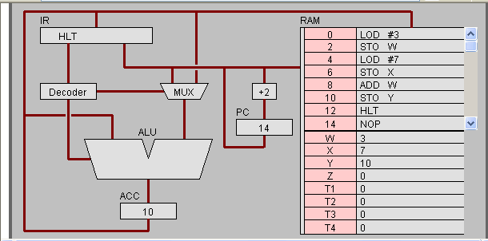
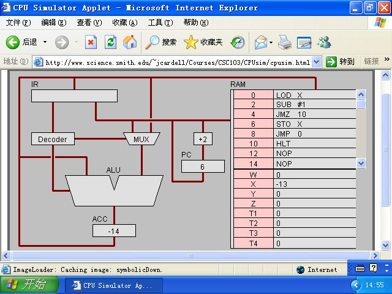

# 机器语言编程


## 任务1

### （2）汇编语言
1. PC与IR
    - PC寄存器：储存下一次要执行的指令
    - IR寄存器：储存当前执行的指令

2. ACC寄存器
    - 全称：accumulater
    - 作用：存储数据，并把存入的数据累加

3. LOD #3
    - *PC*从*RAM*中获取指令**LOD #3**
    - 将**LOD #3**传递到*IR*中，在其中进行解码
    - *IR*将**LOD #3**分成**LOD**和#3两部分解码得到的信息分别传递给*Decoder*和*MUX*
    - 解码完成后，将信息传递到*ALU*按照该指令进行运算，执行该指令
    - 执行完成后，将执行得到的值存入*ACC 寄存器*中
    - *PC* 获取下一条指令

4. ADD W
    - *PC*从*RAM*中获取指令**ADD W**
    - 将该指令传递到*IR*中，在其中进行解码
    - *IR*将**ADD W**分为**ADD**和**W**两部分解码后的信息分别传递给*Decoder*和*MUX*
    - *Decoder*从信息中得知需要获取*ACC 寄存器*中的数值，于是传递信息到*ACC 寄存器*中取得数值
    - 将取得的数值传入*ALU*中
    - *IR*解码**W**后得知需要再从地址为**W**的存储空间中获取数据，于是传递信息到*RAM*，读取位于**W**地址的数据
    - 将数据和信息一同传入*ALU*，开始执行指令
    - 将最终结果存入*ACC 寄存器*中
    - *PC*获取下一条指令

5. LOD #3 与 ADD W 的不同
    
    **LOD #3**执行过程中不需要冲其他地方获取数据，因此执行步骤较少，但**ADD W**需要从*ACC 寄存器*与*RAM*中获取数据，因此执行步骤较多

### （3）Binary
1. **LOD #7** = **00010100 00000111**
    - **0001**是*Operation code*，表示将要执行的操作
    - **0**是*Register specifier*，表示数据将存入哪个寄存器
    - **100**是*addressing mode*，指的是如何看待后面的数据，是视作地址，还是视作可用数据
    - **00000111**是*operand specifier*，代表着指令执行所需要的数据

2. RAM的地址

RAM的地址指的是数据在RAM中存储位置的代号，其作用是给每个存储数据编号，以便在需要的时候能准确提取出来使用

3. 16位
4. 
~~~
int a = 3;
int c = a + 3;
~~~

## 任务2

### (1)
1. 不断循环，每次循环都使X减一。
2.
-  C语言
~~~
int a;
for( a = 3 ; a == 0 ; ){
    a = a - 1;
}
~~~
3. 
    - C 语言：
~~~
int a = 0;
for( int i = 0 ; i > 0 ; i -- ){
    a = a + i;
}
~~~
- 机器语言
```
 0  LOD 10
 2  STO X
 4  LOD X
 6  JMZ 
 8  ADD Y
 10 STO Y
 12 LOD X
 14 SUB #1
 16 STO X
 18 JMP 3
 20 HTL
```
- 高级语言于低级语言之间的区别与联系
    - 区别：高级语言的语法更符合人的思维，而且句子功能更加强大，但无法被机器直接识别；低级语言的语法则更偏向于机器思维，每个句子的都只能执行最基础的功能，但能被机器直接识别。
    - 联系：高级语言要让机器识别必须先编译成低级语言。