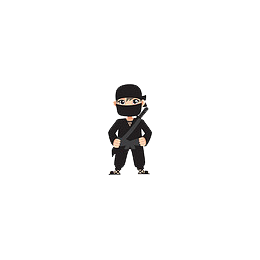
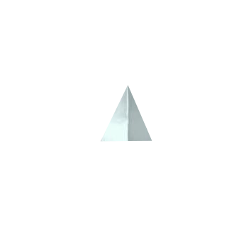
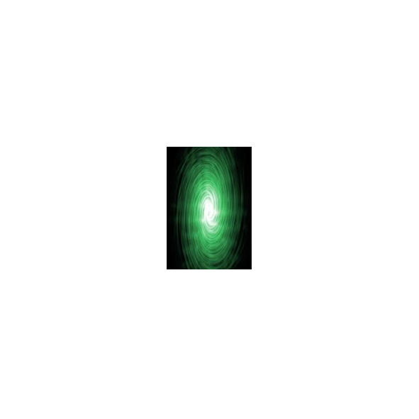
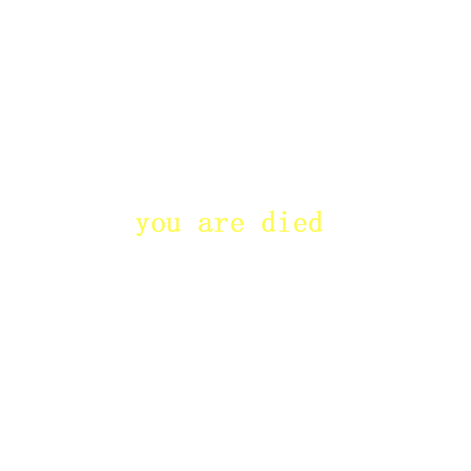
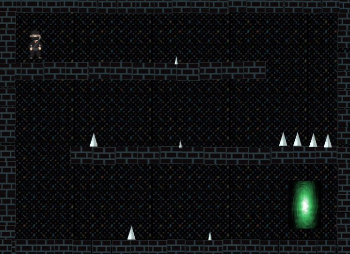
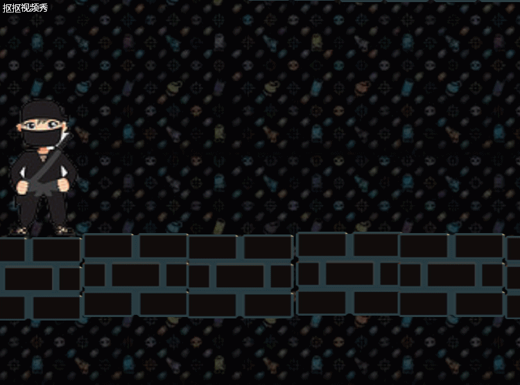
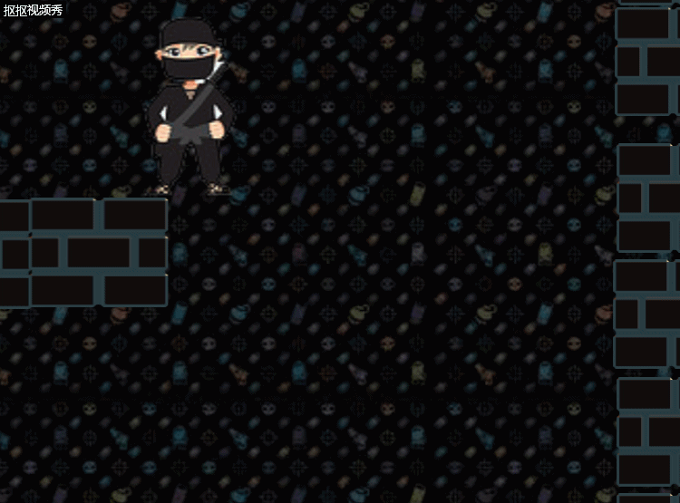
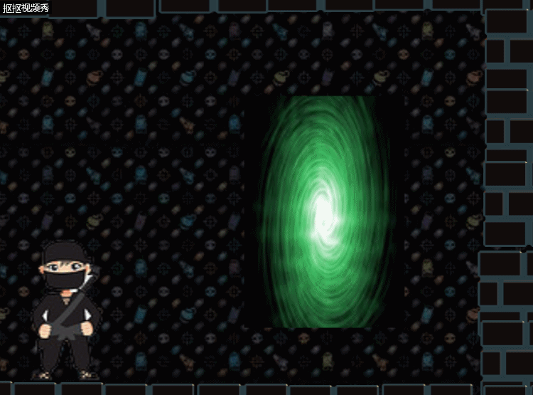

# 忍者追击
## 游戏策划
### 楔子
公元1324年，瀛国国君昏庸无道，瀛国百姓民不聊生。为替天行道，忍者孙带上了祖传圣物 ———— 破空手里剑，走上了刺杀国君的道路。不料，计划败露，国君逃入了皇宫下方地道。匆忙赶到的忍者孙只好进入阴暗的地道中，为了防止昏庸国君逃生，请玩家操纵忍者孙追上逃亡的国君，替天行道！

### 玩法
玩家操作忍者孙在地道中穿行，躲避遇到的各类陷阱。必要时可通过使用道具 ———— 破空手里剑，帮助忍者孙通过地道。  
- 通过方向键控制忍者孙移动
- 按鼠标左键发射破空手里剑
- 空格键使忍者孙瞬移到破空手里剑所在位置
- 回车键重新开始游戏

## 游戏角色
- 忍者孙：游戏主角，玩家通过控制其活动进行游戏。  

- 地刺：地道中的陷阱，忍者孙触碰到后会死亡，游戏失败  

- 破空手里剑：拥有神秘力量的手里剑，可让忍者孙拥有瞬移的能力  

- 漩涡传送门：地道终点，昏君便是通过此处逃生，来到此处游戏就胜利了

- 砖块  

- 失败语  

- 胜利语  

- 游戏地图

## CRC卡片
1. 
- Object：忍者孙  
- Attribute：图片  
- Collaborator：精灵  
- Events & Actions：
    - 与陷阱接触 & 忍者孙消失；出现失败语**You are died**
    - 与漩涡传送门接触 & 忍者孙消失，出现胜利语
    - 鼠标左键单击 & 发射出破空手里剑
    - 按下空格键 & 忍者孙消失；忍者孙出现在破空手里剑所在位置
    - 按下回车键 & 忍者孙出现在初始位置

2. 
- Object：破空手里剑  
- Attribute：图片 、位置 
- Collaborator：精灵  
- Events & Actions：
    - 与砖头接触 & 手里剑消失
    - 鼠标左键单击 & 破空手里剑朝着鼠标所在位置发射；上一个手里剑消失

3.  
- Object：失败语  
- Attribute：图片  
- Collaborator：精灵  
- Events & Actions：
    - 忍者孙与陷阱接触 & 失败语出现
    - 按下回车键 & 失败语消失

4. 
- Object：胜利语  
- Attribute：图片  
- Collaborator：精灵  
- Events & Actions：
    - 忍者孙与漩涡传送门接触 & 胜利语
    - 按下回车键 & 胜利语消失

## 游戏截图
1. 破空手里剑

2. 死亡  

3. 胜利
