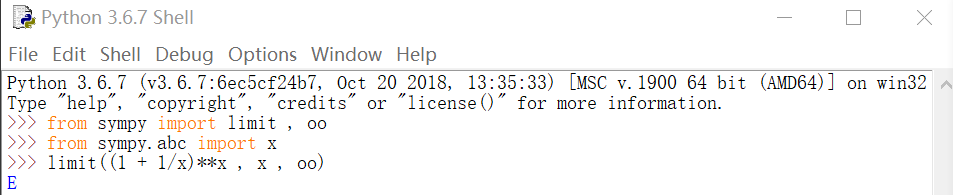
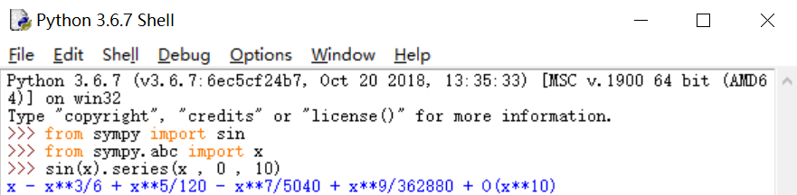
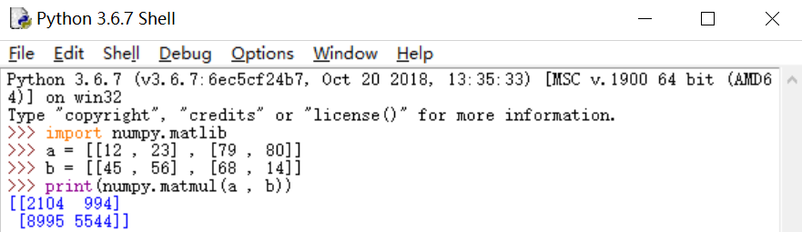
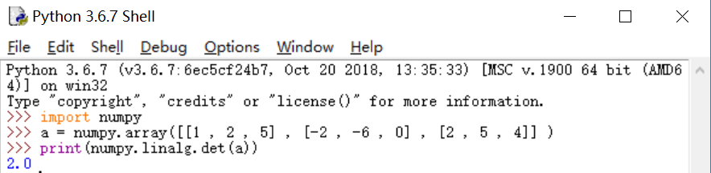

# 用 python 解数学题
## 高等数学
### 求极限
- 所需函数：**limit (exp ， value ， point)**
- 函数使用方法：   
    - 从 sympy 中导入该函数 , 即特殊量 正无穷**oo**
        ~~~
        >>> from sympy import limit , oo
        ~~~
    - 导入所需变量
        ~~~
        >>> from sympy.abc import x
        ~~~
    - 填入数据/表达式
        - **exp** 处填入函数 例如 (1 + 1/x)**x
        - **value** 处填入取极限的自变量 例如 x
        - **point** 处填入所取极限的值 例如 oo
        - 完整格式
            ~~~
            >>> limit ((1 + 1/x)**x , x , oo )
            ~~~
    - 输出结果
    

### 泰勒展开
- 所需方法：**.series(value , 0 , num)**
- 使用方法：
    - 导入所需变量以及函数
    ~~~
    >>> from sympy.abc import x 
    ~~~
    ~~~
    >>> from sympy import sin
    ~~~
    - 填入数据
        - 在**value**处填入自变量，例如：x
        - 在**num**处填入展开的级数，例如：10
        - 将该方法接到需要展开的表达式后方：例如 sin(x)后方
        - 完整格式：
        ~~~
        >>> sin(X).series(x , 0 , 10)
        ~~~
    - 输出结果：
    

## 线性代数
### 求矩阵相乘
- 所需函数：**numpy.matmul**
- 使用方法：
    - 导入所需函数:
    ~~~
    import numpy.matlib
    ~~~
    - 将需要相乘的两个矩阵存入变量:
    ~~~
    a = [[12 , 23] , [79 , 80]]
    b = [[45 , 56] , [68 , 14]]
    ~~~
    - 调用该函数并打印出结果
    ~~~
    print(numpy.matmul(a , b))
    ~~~
    - 输出结果：
    

### 求行列式
- 所需函数：**numpy.linalg.det()**
- 使用方法：
    - 导入所需函数：
    ~~~
    import numpy
    ~~~
    - 声明矩阵：
    ~~~
    a = numpy.array([ [ 1, 2,5], [-2,-6,0] ,[2, 5, 4]]
    ~~~
    - 调用函数并打印结果：
    ~~~
    print(numpy.linalg.det(a))
    ~~~
    - 输出结果
    