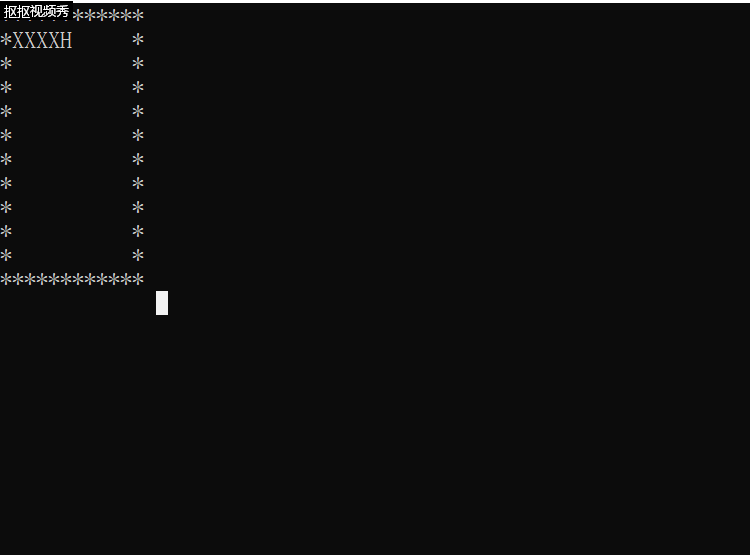
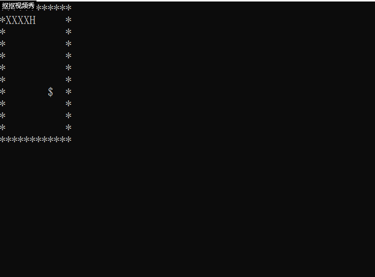

# 贪吃蛇实验报告

## 会动的蛇 

### 实验代码
~~~
/* 贪吃蛇移动*/

#include <stdio.h>
#include <stdlib.h>

/* 定义贪吃蛇属性*/
#define SNAKE_MAX_LENGTH 20
#define SNAKE_HEAD 'H'
#define SNAKE_BODY 'X'
/* 定义游戏地图元素*/ 
#define WALL '*'
#define FOOD '$'

/* 游戏地图*/
char map[12][12] = 
{"************",
"*XXXXH     *",
"*          *",
"*          *",
"*          *",
"*          *",
"*          *",
"*          *",
"*          *",
"*          *",
"*          *",
"************" 
 };  
 
/* 定义蛇的初始状态*/
int snake_length = 5; 
int snake_X[SNAKE_MAX_LENGTH] = {1 , 2 , 3 , 4 , 5};
int snake_Y[SNAKE_MAX_LENGTH] = {1 , 1 , 1 , 1 , 1};

/* 贪吃蛇移动，dy = -1（向上） / 1（向下）  ， dx = -1（向左）/ 1（向右） ， 0（不移动） */
void snake_move (int dy , int dx);
/* 打印新图像*/
void output(void);
/*游戏结束界面*/
void gameover(void);
/* 判断游戏是否结束*/
int if_dead(void); 
/* 判断蛇是否咬到自己*/
int eat_itself(void); 

int main(){
	char input;/*输入数据*/ 
	output();/*打印出初始地图
	 正式开始游戏*/ 
	while(if_dead()){
		input = getchar()/*读取玩家输入的指令*/ 
		/* 识别并执行指令 */
		switch(input){
			case 'A':
			case 'a':
				snake_move(0 , -1);
				break;
			case 'D':
			case 'd':
				snake_move(0 , 1);
				break;
			case 'W':
			case 'w':
				snake_move(-1 , 0);
				break;
			case 'S':
			case 's':
				snake_move(1 , 0);
				break;
			default:
				break;
		}
		output();/* 打印执行过指令后的地图 */
	} 
	gameover();/* 打印游戏结束界面*/
	return 0; 
} 

int if_dead(){
	if(snake_X[snake_length - 1] == 0 || snake_X[snake_length - 1] == 11 
	|| snake_Y[snake_length - 1] == 0 || snake_Y[snake_length - 1] == 11)
		return 0;
	if(eat_itself())
		return 0;
	return 1;
}

int eat_itself(){
	int i , j;
	for(i = 0 ; i < snake_length ; i ++){
		for( j = i + 1 ; j < snake_length ; j ++)
			if(snake_X[i] == snake_X[j] && snake_Y[i] == snake_Y[j])
				return 1;
	}
	return 0;
}	

void snake_move(int dy , int dx){
	/* 判断贪吃蛇能否如此移动 */
	if((snake_X[snake_length - 1] + dx )== snake_X[snake_length - 2]
		&& (snake_Y[snake_length - 1] + dy) == snake_Y[snake_length - 2])
		return;
	int i; 
	for(i = 0 ; i < snake_length - 1 ; i ++){
		snake_X[i] = snake_X[i + 1];
		snake_Y[i] = snake_Y[i + 1];
	}
	snake_X[snake_length - 1] += dx;
	snake_Y[snake_length - 1] += dy;
	return;
}

void output(){
	system("cls");/*清空页面*/
	int x , y , i , j;
	for( x = 0 ; x < 12 ; x ++ ){
		for( y = 0 ; y < 12 ; y ++){
			if( x == 0 || x == 11 || y == 11 || y == 0)
				map[x][y] = '*';
			else 
				map[x][y] = ' ';
		}
	}
	for( i = 0 ; i < snake_length - 1 ; i ++ ){
			map[snake_Y[i]][snake_X[i]] = 'X';
		map[snake_Y[snake_length - 1]][snake_X[snake_length - 1]] = 'H'; 
	}
	/*重新打印页面*/ 
	for( i = 0 ; i < 12 ; i ++ ){
		for( j = 0 ; j < 12 ; j ++ ){
			printf("%c",map[i][j]);
		}
		printf("\n");
	}
}

void gameover(){
	system("cls");
	printf("END!");
	return;
}
~~~

### 效果展示

## 会吃东西的蛇
### 实验代码
~~~
/* 贪吃蛇移动*/

#include <stdio.h>
#include <stdlib.h>
#include <time.h>

/* 定义贪吃蛇属性*/
#define SNAKE_MAX_LENGTH 20
#define SNAKE_HEAD 'H'
#define SNAKE_BODY 'X'
/* 定义游戏地图元素*/ 
#define WALL '*'
#define FOOD '$'

/* 游戏地图*/
char map[12][12] = 
{"************",
"*XXXXH     *",
"*          *",
"*          *",
"*          *",
"*          *",
"*          *",
"*          *",
"*          *",
"*          *",
"*          *",
"************" 
 };  
 
/* 定义蛇的初始状态*/
int snake_length = 5; 
int snake_X[SNAKE_MAX_LENGTH] = {1 , 2 , 3 , 4 , 5};
int snake_Y[SNAKE_MAX_LENGTH] = {1 , 1 , 1 , 1 , 1}; 
/*食物的地址*/
int food_X = 8;
int food_Y = 7; 

/* 贪吃蛇移动，dy = -1（向上） / 1（向下）  ， dx = -1（向左）/ 1（向右） ， 0（不移动） */
void snake_move (int dy , int dx);
/* 打印新图像*/
void output(void);
/*游戏结束界面*/
void gameover(void);
/* 判断游戏是否结束*/
int if_dead(void); 
/* 判断蛇是否咬到自己*/
int eat_itself(void); 
/*蛇吃到食物后*/
void eat_food(int dx , int dy);
/*生成食物*/
void produce(void); 

int main(){
	char input;/*输入数据*/ 
	output();/*打印出初始地图
	 正式开始游戏*/ 
	while(if_dead()){
		input = getchar()/*读取玩家输入的指令*/ 
		/* 识别并执行指令 */
		switch(input){
			case 'A':
			case 'a':
				snake_move(0 , -1);
				break;
			case 'D':
			case 'd':
				snake_move(0 , 1);
				break;
			case 'W':
			case 'w':
				snake_move(-1 , 0);
				break;
			case 'S':
			case 's':
				snake_move(1 , 0);
				break;
			default:
				break;
		}
		output();/* 打印执行过指令后的地图 */
	} 
	gameover();/* 打印游戏结束界面*/
	return 0; 
} 

int if_dead(){
	if(snake_X[snake_length - 1] == 0 || snake_X[snake_length - 1] == 11 
	|| snake_Y[snake_length - 1] == 0 || snake_Y[snake_length - 1] == 11)
		return 0;
	if(eat_itself())
		return 0;
	return 1;
}

int eat_itself(){
	int i , j;
	for(i = 0 ; i < snake_length ; i ++){
		for( j = i + 1 ; j < snake_length ; j ++)
			if(snake_X[i] == snake_X[j] && snake_Y[i] == snake_Y[j])
				return 1;
	}
	return 0;
}	

void snake_move(int dy , int dx){
	/* 判断贪吃蛇能否如此移动 */
	if(map[(snake_Y[snake_length - 1] + dy)][(snake_X[snake_length - 1] + dx)] == '$'){
		eat_food(dx , dy);
		return;
	}
	if((snake_X[snake_length - 1] + dx )== snake_X[snake_length - 2]
		&& (snake_Y[snake_length - 1] + dy) == snake_Y[snake_length - 2])
		return;
	int i; 
	for(i = 0 ; i < snake_length - 1 ; i ++){
		snake_X[i] = snake_X[i + 1];
		snake_Y[i] = snake_Y[i + 1];
	}
	snake_X[snake_length - 1] += dx;
	snake_Y[snake_length - 1] += dy;
	return;
}

void output(){
	system("cls");/*清空页面*/
	int x , y , i , j;
	for( x = 0 ; x < 12 ; x ++ ){
		for( y = 0 ; y < 12 ; y ++){
			if( x == 0 || x == 11 || y == 11 || y == 0)
				map[x][y] = '*';
			else 
				map[x][y] = ' ';
		}
	}
	map[food_Y][food_X] = '$';
	for( i = 0 ; i < snake_length - 1 ; i ++ ){
			map[snake_Y[i]][snake_X[i]] = 'X';
		map[snake_Y[snake_length - 1]][snake_X[snake_length - 1]] = 'H'; 
	}
	/*重新打印页面*/ 
	for( i = 0 ; i < 12 ; i ++ ){
		for( j = 0 ; j < 12 ; j ++ ){
			printf("%c",map[i][j]);
		}
		printf("\n");
	}
}

void gameover(){
	system("cls");
	printf("END!");
	return;
}

void eat_food(int dx , int dy){
	snake_length ++;
	snake_X[snake_length - 1] = snake_X[snake_length - 2] + dx;
	snake_Y[snake_length - 1] = snake_Y[snake_length - 2] + dy;
	produce_food();
}

void produce_food(){
	srand((unsigned)time(0));
	while(1){
		food_X = rand()%12;
		food_Y = rand()%12;
		if(map[food_Y][food_X] == ' '){
			break;
		}
	}
} 
~~~

### 效果展示

