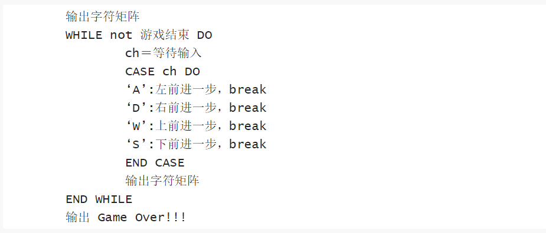

# 字符贪吃蛇游戏设计

字符贪吃蛇是一个使用 **c** 语言做出来的简单小游戏，游戏画面全部由字符组成，算法较为简单。

## 游戏设计
### 能动的蛇设计思路 

采用自上而下的程序设计方法
- 首先按照伪代码（如图一）编写出程序主体的**main**函数，只需设计出基础的结构，不必关注各个功能实现的细节，下一层的函数来解决。
图一：

- 按照主函数的需要，为各个功能编写实现的函数：
    - **void snake_move (int dy , int dx)** 函数，用于根据读取到的数据，通过改变贪吃蛇身体各部位的位置（**snake_X** , **snake_Y**），实现贪吃蛇的移动
    - **void output(void)** 函数，首先清空控制台上已有的图像，再按照数组**map**以及**snake_X** 、 **snake_Y**的值打印出游戏地图以及贪吃蛇
    - **void gameover(void)** 打印游戏结束界面
    - 这一层级的一些功能譬如：判断贪吃蛇是否死亡等等，可以不予关注，留给下一层
- 根据上一层的需要编写合适的函数，例如：
    - **int if_dead(void)**，用于判断蛇移动后是否死亡
    - **int eat_itself(void)**，用于判断贪吃蛇移动是否会咬到自己，即头部与身体重合
- 为整个代码设计一个合格的程序头，导入所需的函数库，预先声明好函数和全局变量。

具体的代码请点击这一页面：[(win 10)snake_move.c](snake_move.c)

### 会吃东西的蛇
以上方**能动的蛇**的代码为基础进行改造，增加函数以实现特定功能，如下
- **void eat_food(int dx , int dy)** 将蛇身的长度增加一，并实现移动
- **void produce_food(void)** 在地图上的空白处随机生成食物，在上一个函数执行完后（即食物被吃后）执行。

改造后代码如下：[(win 10)snake_eat.c](snake_eat.c)

### 优化输入
在上面的代码中我们使用，函数**getchar()** 读取玩家的输入，但是每次输入后都必须按下回车才能让程序开始执行。这严重影响了我们的游戏体验，因此，为了让输入更加方便，我引入了老师提供的几个函数：
- **int tty_reset(void)**
- **int tty_set(void)** 
- **int kbhit(void)**

并修改了原本的输入方式：
- 原：
~~~
input = getchar();
~~~
- 现：
~~~
if( kbhit() ){
	input = go_next();
}
~~~  
如此便可直接读取键盘的输入，不必输入回车。但是，如果仅仅做出这样的改造，你会发现你的蛇将会迅速一头撞到墙上。因为计算机的运行速度太快，进行一次循环的时间实在太短，我们没法进行操作。因此我们还需要让程序慢下来。为此，我们在while函数块的末尾使用了**sleep**函数，使程序在此处停顿一秒。
~~~
sleep(1);
~~~
最终，优化过后的蛇的代码如下：[(linux)snake.c](snake.c)

## 智能蛇
只要设计出合适的算法，蛇也能拥有自己的智能，能够自己绕开障碍物，吃到食物。
同样采用自上而下的设计方法

- 首先按照下方图二中的伪代码编写出主函数**main()**,从中不难看出，该程序与上面几个程序的结构大致相同，不过在移动方向的选择上采用了智能算法。  
图二：

- 接着，补充次一层的函数，同时我们需要为智能蛇设计一个选择前进方向的智能算法，按照下方图三的伪代码进行设计即可。  我设计的智能算法如下**go_next()** 函数：
~~~
char go_next(void){
	int i;
	int id , min = 100000;
	char direction[4] = { 'w' , 'a' , 's' , 'd' };
	int instance[4] = {0};
	for( i = 0 ; i < 4 ; i ++ ){
		instance[i] = get_ins(direction[i]);
	}
	for( i = 0 ; i < 4 ; i ++ ){
		if(instance[i] < min){
			min = instance[i];
			id = i;
		}
	}
	if(direction[id] >= 9999){
		return '#';
	}
	return direction[id];
} 
~~~
图三：

- 补充编写上方**go_next()**函数中需要的函数**int get_ins(char ch)**以及**int food_head_ins(int x , int y)**两个函数，即可实现智能算法

智能蛇代码在此：[(linux)snake_ai.c](snake_ai.c)

## 实验收获
亲手编写一个贪吃蛇游戏，真的是非常由有趣且有意义的一件事。看着一个游戏在自己的手里渐渐成型，获得的成就感是巨大的。  
同时在编写游戏的过程中常需要使用一些自己从来没有学过的知识比如随机数、计时器等，我们只能通过网络搜索相关知识点，现学现用。在这样的搜索过程中，我们也同时学到了很多其他的知识。  
我想，对于一个学计算机的学生而言，下面的这种学习过程将成为我们往后学习的一种重要形式。
~~~
遇到问题 ——> 上网查阅资料 ——> 学习相关知识 ——> 找到解决方法 ——> 掌握解决方法
~~~