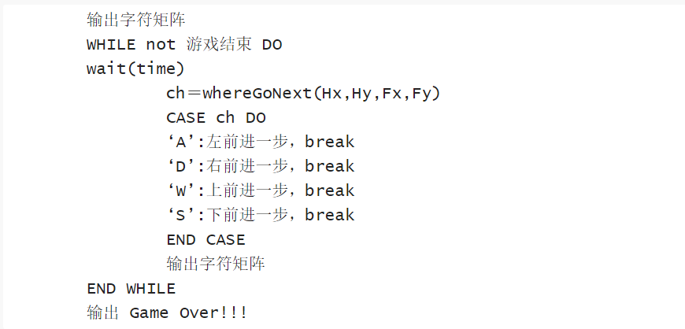
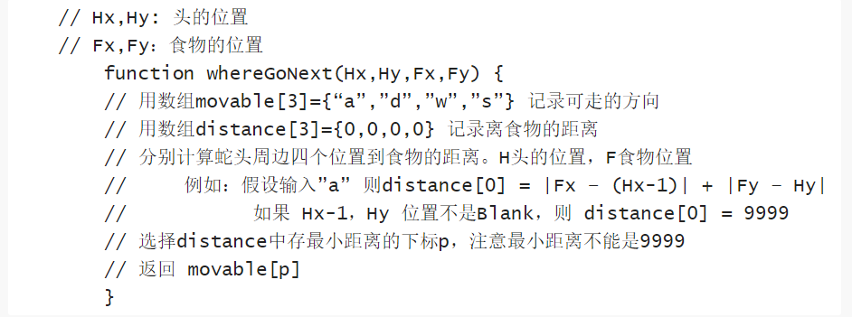

# 智能蛇
只要设计出合适的算法，蛇也能拥有自己的智能，能够自己绕开障碍物，吃到食物。

## 设计思路
同样采用自上而下的设计方法

- 首先按照下方图二中的伪代码编写出主函数**main()**,从中不难看出，该程序与上面几个程序的结构大致相同，不过在移动方向的选择上采用了智能算法**go_next()** 。  
图二：

- 接着，补充次一层的函数，同时我们需要为智能蛇设计一个选择前进方向的智能算法，按照下方图三的伪代码进行设计即可。  
这是我设计的智能算法**go_next()** 函数：
~~~
char go_next(void){
	int i;
	int id , min = 100000;
	char direction[4] = { 'w' , 'a' , 's' , 'd' };
	int instance[4] = {0};
	for( i = 0 ; i < 4 ; i ++ ){
		instance[i] = get_ins(direction[i]);
	}
	for( i = 0 ; i < 4 ; i ++ ){
		if(instance[i] < min){
			min = instance[i];
			id = i;
		}
	}
	if(direction[id] >= 9999){
		return '#';
	}
	return direction[id];
} 
~~~
图三：

- 补充编写上方**go_next()**函数中需要的函数**int get_ins(char ch)**以及**int food_head_ins(int x , int y)**两个函数，即可实现智能算法
~~~
/蛇头部与食物的距离/
int food_head_ins(int x , int y){
	int a = x - food_X;
	int b = y - food_Y;
	if(a < 0) a = - a;
	if(b < 0) b = - b;
	return (a + b);
}

/*预测走向每个方向的结果*/
int get_ins(char ch){
	int head_X = snake_X[snake_length - 1];
	int head_Y = snake_Y[snake_length - 1];
	switch(ch){
		case 'w':
			head_X += 0;
			head_Y -= 1;
			break;
		case 'a':
			head_X -= 1;
			head_Y += 0;
			break;
		case 's':
			head_X += 0;
			head_Y += 1;
			break;
		case 'd':
			head_X += 1;
			head_Y += 0;
		default:
			break;
	}
	if(map[head_X , head_Y] != ' '){
		return 999;
	}
	return food_head_ins(head_X , head_Y);
}
~~~

智能蛇代码在此：[(linux)snake_ai.c](snake_ai.c)

## 实验收获
亲手编写一个贪吃蛇游戏，真的是非常由有趣且有意义的一件事。看着一个游戏在自己的手里渐渐成型，我获得的成就感是巨大的。  
在编写游戏的过程中常需要使用一些自己从来没有学过的知识比如随机数、计时器等。我只能通过网络搜索相关知识点，现学现用。而在这样的搜索过程中，我们也能同时学到很多其他方面的知识。  
我想，对于一个学计算机的学生而言，这种学习过程将成为我们往后学习的一种重要形式。
~~~
遇到问题 ——> 上网查阅资料 ——> 学习相关知识 ——> 找到解决方法 ——> 掌握解决方法
~~~